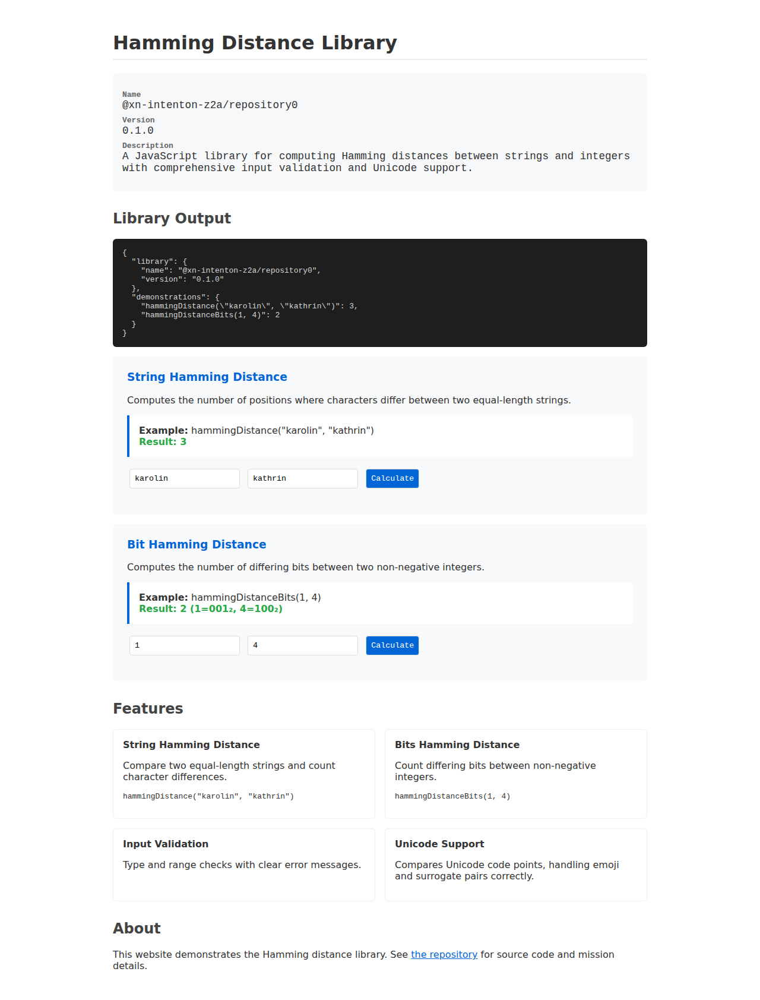

# Hamming Distance Library



A JavaScript library for computing Hamming distances between strings and integers with comprehensive input validation and Unicode support.

## Installation

```bash
npm install @xn-intenton-z2a/repository0
```

## Usage

### String Hamming Distance

Compare two strings of equal length and count the positions where characters differ:

```javascript
import { hammingDistance } from '@xn-intenton-z2a/repository0';

// Basic usage
hammingDistance("karolin", "kathrin"); // Returns: 3
hammingDistance("hello", "world");     // Returns: 4
hammingDistance("", "");               // Returns: 0

// Unicode support
hammingDistance("café", "cave");       // Returns: 2
hammingDistance("🎉🎊", "🎉🌟");        // Returns: 1
```

### Bits Hamming Distance

Compare two non-negative integers and count the differing bits:

```javascript
import { hammingDistanceBits } from '@xn-intenton-z2a/repository0';

// Basic usage
hammingDistanceBits(1, 4);   // Returns: 2 (binary: 001 vs 100)
hammingDistanceBits(5, 3);   // Returns: 2 (binary: 101 vs 011)  
hammingDistanceBits(0, 0);   // Returns: 0
```

## API Reference

### `hammingDistance(a, b)`

Computes the Hamming distance between two strings of equal length.

**Parameters:**
- `a` (string): First string
- `b` (string): Second string

**Returns:** `number` - Number of positions where characters differ

**Throws:**
- `TypeError` - If arguments are not strings
- `RangeError` - If strings have different lengths

### `hammingDistanceBits(x, y)`

Computes the Hamming distance between two non-negative integers (counts differing bits).

**Parameters:**
- `x` (number): First integer (must be non-negative)
- `y` (number): Second integer (must be non-negative)

**Returns:** `number` - Number of differing bits

**Throws:**
- `TypeError` - If arguments are not integers
- `RangeError` - If arguments are negative

## Features

- ✅ **Unicode Support**: Correctly handles Unicode code points, not just UTF-16 code units
- ✅ **Input Validation**: Comprehensive type checking and error handling  
- ✅ **Zero Dependencies**: Pure JavaScript implementation
- ✅ **ESM Support**: Native ES modules with proper exports
- ✅ **Comprehensive Testing**: Full unit test coverage including edge cases
- ✅ **Interactive Demo**: Live web interface at [GitHub Pages](https://xn-intenton-z2a.github.io/repository0/)

## Development

```bash
# Install dependencies
npm install

# Run tests
npm test
npm run test:unit      # Unit tests with coverage
npm run test:behaviour # End-to-end browser tests

# Build and serve website
npm run build:web
npm start
```

## Examples

### Error Handling

```javascript
// Type errors
hammingDistance(123, "abc");        // TypeError: First argument must be a string
hammingDistance("abc", 123);        // TypeError: Second argument must be a string

// Range errors  
hammingDistance("short", "longer"); // RangeError: Strings must have equal length
hammingDistanceBits(-1, 5);        // RangeError: First argument must be non-negative
```

### Unicode Examples

```javascript
// Proper Unicode handling
hammingDistance("résumé", "resume");    // Returns: 2
hammingDistance("🌟⭐", "🌟🌙");         // Returns: 1

// Handles surrogate pairs correctly
const str1 = "𝐀𝐁𝐂";  // Mathematical bold letters
const str2 = "𝐀𝐁𝐃";  
hammingDistance(str1, str2);           // Returns: 1
```

## License

MIT

---

An autonomous repository powered by [agentic-lib](https://github.com/xn-intenton-z2a/agentic-lib).
